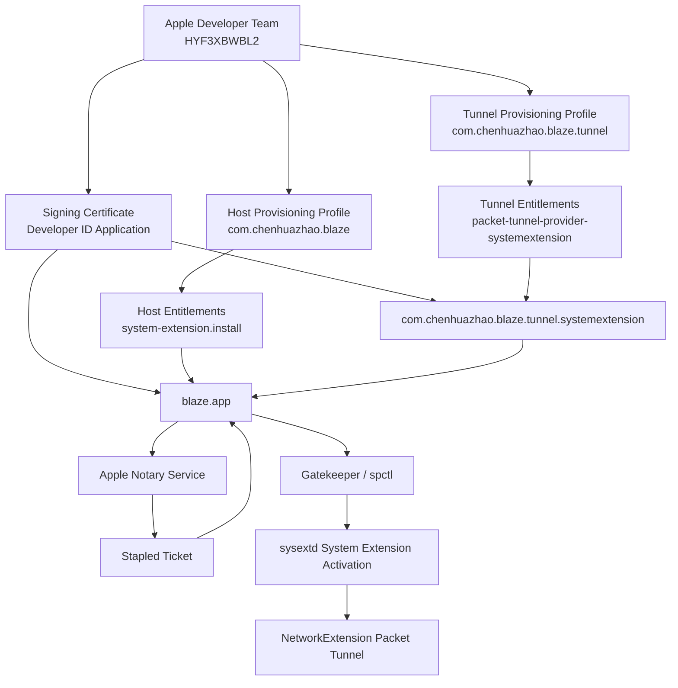

# macOS Signing, Provisioning, and Notarization Notes

This document records the signing model used by Blaze, with emphasis on the
Packet Tunnel System Extension path.

## Why This Matters

Blaze contains privileged macOS networking code:

- Host app bundle: `com.chenhuazhao.blaze`
- Packet Tunnel System Extension bundle: `com.chenhuazhao.blaze.tunnel`
- Apple Developer Team ID: `HYF3XBWBL2`
- Required Network Extension entitlement:
  `com.apple.developer.networking.networkextension = packet-tunnel-provider-systemextension`

The app can build and even pass `codesign --verify` while still failing at
runtime if one of these layers does not line up:

- certificate type
- provisioning profile
- entitlements embedded in the signature
- Team ID
- bundle ID
- notarization ticket
- System Extension activation policy

## Core Concepts

### Apple Developer Team

The Team ID identifies the Apple Developer Program team that owns the signing
assets and entitlements. For Blaze, the Team ID is:

```text
HYF3XBWBL2
```

The host app and its System Extension must normally be signed by the same Team
ID. Apple documents this as a System Extensions requirement unless the extension
has a special redistributable entitlement.

### Bundle ID

Each independently signed bundle has its own bundle ID:

```text
com.chenhuazhao.blaze
com.chenhuazhao.blaze.tunnel
```

The provisioning profile and the code signature both bind entitlements to the
bundle ID. The host app profile cannot authorize the tunnel extension, and the
tunnel profile cannot authorize the host app.

### Certificate

The certificate proves which developer signed the code. The private key in the
local Keychain is used by `codesign`.

Blaze currently has these relevant identities:

```text
Apple Development: Huazhao Chen (8AXLUC98LY)
Developer ID Application: Huazhao Chen (HYF3XBWBL2)
```

Use cases:

- `Apple Development` is for local development builds.
- `Developer ID Application` is for direct distribution outside the Mac App
  Store and for the notarization path.

Do not mix certificate families and provisioning profiles casually. A bundle
signed with an identity that does not match the profile's certificate chain can
pass superficial checks but fail AMFI/profile validation at runtime.

### Provisioning Profile

A provisioning profile is the Apple-issued authorization record for a specific
App ID / Bundle ID. It says:

- which Team owns it
- which certificate type can sign it
- which entitlements Apple authorized
- whether it is limited to registered development devices or all devices

For Blaze, the important local profiles are:

```text
Blaze Developer ID
  Bundle: com.chenhuazhao.blaze
  Entitlement: com.apple.developer.system-extension.install

Blaze Tunnel Developer ID
  Bundle: com.chenhuazhao.blaze.tunnel
  Entitlement: packet-tunnel-provider-systemextension
```

The ordinary value below is not enough for the System Extension bundle:

```text
packet-tunnel-provider
```

The System Extension path requires:

```text
packet-tunnel-provider-systemextension
```

### Entitlements

Entitlements are capabilities embedded into the code signature. For restricted
Apple capabilities, the signed entitlements must be authorized by the embedded
provisioning profile.

In Blaze's restricted build, `scripts/build-app.sh` extracts entitlements from
the selected provisioning profiles and signs with those generated entitlement
files. This prevents accidental drift between local templates and Apple's
actual authorization.

### Code Signature

`codesign` seals the bundle contents and embeds the entitlements. Blaze's
Developer ID path must use:

```text
--options runtime
--timestamp
--sign "Developer ID Application: Huazhao Chen (HYF3XBWBL2)"
```

`--options runtime` enables Hardened Runtime. A secure timestamp is required for
the Developer ID notarization path.

Important local checks:

```bash
codesign --verify --deep --strict --verbose=4 /Applications/blaze.app
codesign -dvvv --entitlements :- /Applications/blaze.app
codesign -dvvv --entitlements :- /Applications/blaze.app/Contents/Library/SystemExtensions/com.chenhuazhao.blaze.tunnel.systemextension
```

Passing `codesign --verify` only means the local signature structure is
internally consistent. It does not prove that Gatekeeper, AMFI, or sysextd will
accept the app for System Extension activation.

### Notarization

Notarization is Apple's automated service for Developer ID software distributed
outside the Mac App Store. It checks for malware and code-signing issues. It is
not App Review.

Blaze uses `notarytool` with a local Keychain profile:

```text
blaze-notary
```

Create that profile once with an Apple Account app-specific password:

```bash
xcrun notarytool store-credentials blaze-notary \
  --apple-id "APPLE_ID_EMAIL" \
  --team-id HYF3XBWBL2
```

Submit and staple:

```bash
BLAZE_NOTARY_PROFILE=blaze-notary ./scripts/notarize-app.sh /Applications/blaze.app
```

After notarization, Gatekeeper should accept the app:

```bash
spctl --assess --type execute --verbose=4 /Applications/blaze.app
```

Expected result:

```text
/Applications/blaze.app: accepted
source=Notarized Developer ID
```

### Stapling

Stapling attaches the notarization ticket to the app bundle. Without stapling,
Gatekeeper can often fetch the ticket online, but stapling makes the artifact
self-contained and is the safer path before installing a System Extension.

Blaze's notarization script runs:

```bash
xcrun stapler staple /Applications/blaze.app
```

### System Extension Activation

System Extension activation is handled by `sysextd`. For Blaze, the app asks
macOS to activate:

```text
com.chenhuazhao.blaze.tunnel
```

Useful checks:

```bash
systemextensionsctl list | grep -i chenhuazhao

/usr/bin/log show --last 10m --style compact \
  --predicate 'process == "sysextd" OR process == "amfid" OR eventMessage CONTAINS "com.chenhuazhao.blaze"'
```

`systemextensionsctl list` should eventually show the current build number, for
example:

```text
HYF3XBWBL2 com.chenhuazhao.blaze.tunnel (0.1.0/21) [activated enabled]
```

## Relationship Map



## Blaze Build Flow

Restricted System Extension build:

```bash
BLAZE_ENABLE_SYSTEM_EXTENSION_ENTITLEMENTS=1 \
BLAZE_SIGN_IDENTITY="Developer ID Application: Huazhao Chen (HYF3XBWBL2)" \
BLAZE_BUILD_NUMBER=21 \
BLAZE_APP_PROVISIONING_PROFILE="$HOME/Library/MobileDevice/Provisioning Profiles/3a17b845-d49a-42d2-804b-21caaab299d8.provisionprofile" \
BLAZE_TUNNEL_PROVISIONING_PROFILE="$HOME/Library/MobileDevice/Provisioning Profiles/154fc183-7658-408f-9b6a-ecd5bb806af5.provisionprofile" \
./scripts/build-app.sh --install
```

Notarize:

```bash
BLAZE_NOTARY_PROFILE=blaze-notary ./scripts/notarize-app.sh /Applications/blaze.app
```

Then in Blaze UI:

```text
Settings -> Packet Tunnel -> Install Extension
Settings -> Packet Tunnel -> Install Config
Settings -> Packet Tunnel -> Start Tunnel
```

## Common Failure Modes

### Ordinary Packet Tunnel Entitlement

Symptom:

```text
No provisioning profile found for com.chenhuazhao.blaze.tunnel with
com.apple.developer.networking.networkextension containing any of:
packet-tunnel-provider-systemextension
```

Cause:

The profile contains `packet-tunnel-provider`, not
`packet-tunnel-provider-systemextension`.

Fix:

Use the Developer ID profile whose Network Extension entitlement contains
`packet-tunnel-provider-systemextension`.

### Certificate / Profile Mismatch

Symptom in logs:

```text
Unsatisfied entitlements:
com.apple.developer.team-identifier,
com.apple.developer.networking.networkextension,
keychain-access-groups

No matching profile found
```

Cause:

The bundle is signed with an identity that does not match the embedded
provisioning profile's authorized certificate family.

Fix:

Use the explicit Developer ID identity together with the Developer ID profiles.

### Unnotarized Developer ID

Symptom:

```text
OSSystemExtensionErrorDomain Code=8 "code signature invalid"
```

and:

```bash
spctl --assess --type execute --verbose=4 /Applications/blaze.app
```

returns:

```text
/Applications/blaze.app: rejected
source=Unnotarized Developer ID
```

Cause:

The app is correctly Developer ID signed, but it has not been accepted by Apple
Notary Service and stapled.

Fix:

Run `scripts/notarize-app.sh`, then retry System Extension activation.

### Old System Extension Still Active

Symptom:

```text
com.chenhuazhao.blaze.tunnel (0.1.0/1) [activated enabled]
```

while a newer app build is installed.

Cause:

macOS keeps the old System Extension active until the new one validates and
activates. Failed upgrades leave the old active version in place.

Fix:

Fix the signing/notarization issue first. Then click `Install Extension` again.
If entries are `terminated waiting to uninstall on reboot`, reboot clears them.

## References

- Apple Developer: [System Extensions](https://developer.apple.com/documentation/systemextensions)
- Apple Developer: [Notarizing macOS software before distribution](https://developer.apple.com/documentation/security/notarizing-macos-software-before-distribution)
- Apple Support: [Sign in to apps with your Apple Account using app-specific passwords](https://support.apple.com/en-la/102654)
